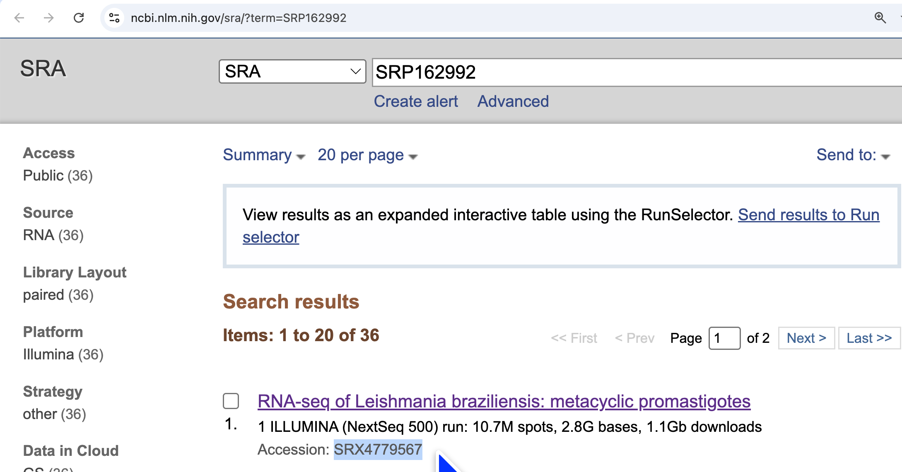
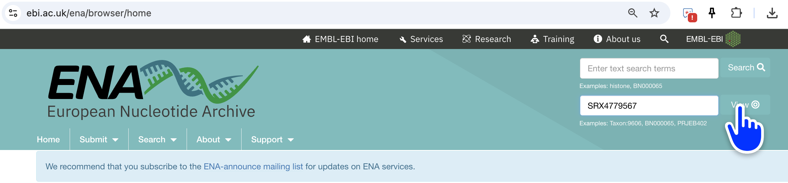
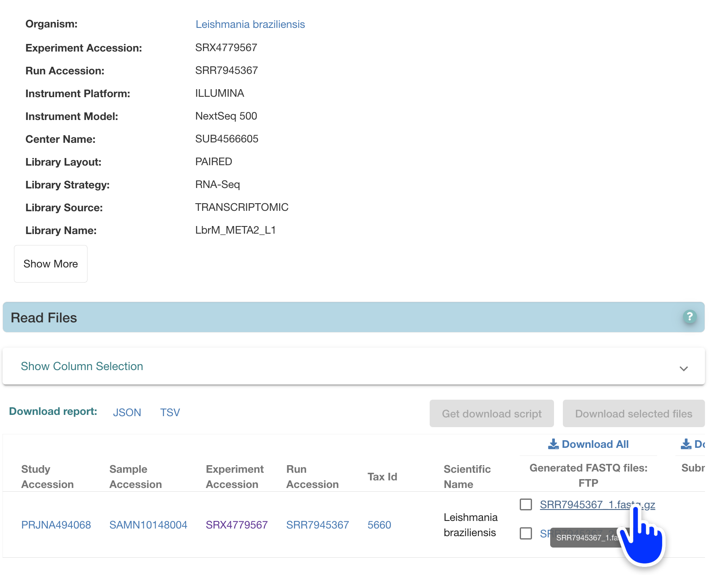

# Download FASTQ files from SRA and/or ENA 

To download raw FASTQ files from SRA

## Choose which samples to download 

Browse the files available at [NCBI SRA](http://ncbi.nlm.nih.gov/sra/?term=SRP162992) and choose which files to download. 

Copy the Accession number for each file: 

## Paste the accession number into ENA

Paste the accession number into the [European Nucleotide Archive](https://www.ebi.ac.uk/ena/browser/home) in the top right hand search boxes. 

## Click the fastq file links to download them directly. 

You want to click both fastq files (e.g. SRR7945367_1.fastq.gz and SRR7945367_2.fastq.gz) to download them. 

The file ending _1 is the *forward read* and the file ending _2 is the *reverse read*. 

## Move them into your working folder

You can now move these files into your **working folder** - this is the folder on your computer where you are also writing your R and Python code. 

Keep a record of which sample is which - I recommend an Excel Spreadsheet with the accession number and which file it is. 

| Study Accession | Read accession | Sample | 
| -- | -- | -- |
| SRP162992 | SRR7945367 | Leishmania braziliensis metacyclic promastigote |

::: {.callout-caution}
Make sure the accession matches what is on the **filename** so that you don't get confused - eg. SRR7945367 for SRR7945367_1.fastq.gz 

This is usually the **Run Accession** 
:::

