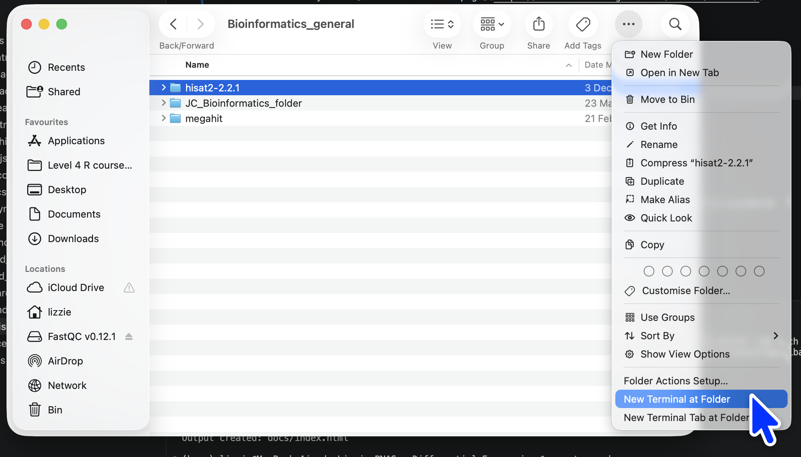

# Install Hisat2 for mapping 

To install Hisat2

Download the binary from [The Hisat2 Github page](https://daehwankimlab.github.io/hisat2/download/). For Mac, it is the OSX_x86_64 version. 

Double click to decompress the file to give you a folder 

Move the folder to somewhere safe in your Documents 

Open the folder using the terminal: 



Check it works 

Run 

```bash
./hisat2 -help
```

You may need to unblock from Apple security settings (Apple System setting -> Security and Privacy -> Allow Anyway)

Once it works, you want to add this folder to your path (so you can access the program from anywhere)

This command will give you the full folder location: 

```bash
pwd
``` 

For me this was: 
`/Users/lizzie/Documents/Kingston/Bioinformatics_general/hisat2-2.2.1`

Then use this folder location (replace with your own) and run the following two lines: 

```bash
echo 'export PATH="$PATH:/Users/lizzie/Documents/Kingston/Bioinformatics_general/hisat2-2.2.1"' >> ~/.zshrc
source ~/.zshrc
```

::: {.callout-caution}
The `>>` being doubled is really important here. 

`>>` will take the result and add it to the bottom of the ~/.zshrc file, `>` would **overwrite** the file. 
:::


You can then open the terminal from a different folder, and you should be able to run:

```bash
hisat2 -help
```

This means the installation has worked. 